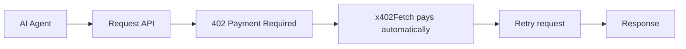

# x402-aa-wallet

**The easiest way for an ERC-4337 / account-abstraction agent to pay x402
API calls — with a dedicated, non-custodial EOA, since its smart-wallet
signature doesn't work with x402 yet.**

A lightweight, TypeScript-first SDK: generate a spend wallet, fund it from
your agent's own smart wallet, and every request through it pays x402
(HTTP 402) challenges automatically — retried and returned, no manual
handling — against **any** x402 merchant.



## Features

- 🤖 Built for ERC-4337 / account-abstraction agents
- 💳 Automatic x402 payment handling — detect a 402, pay, retry, transparently
- 💰 Optional `maxAmountUsd` (per-call) and `maxTotalUsd` (per-session) spend caps — real enforcement boundaries, not just docs warnings
- ✅ USDC asset verification always on — a merchant cannot get a signature for an arbitrary token contract
- 🔒 Non-custodial — the private key never leaves your process, and isn't even enumerable on the returned object (safe to log the wallet by accident)
- ⚡ Minimal dependencies (`viem` + `@x402/*`)
- 🌐 Works against any x402-compatible API
- 📦 TypeScript-first, with full types included
- 🐍 Python implementation also available (see Related projects)

## Installation

```bash
npm install x402-aa-wallet
```

## Quick start

```ts
import { createSpendWallet, getUsdcBalance, x402Fetch } from "x402-aa-wallet";

// 1. Generate a dedicated spend wallet — locally, once.
const wallet = createSpendWallet();
console.log("fund this address:", wallet.address);
// store wallet.privateKey yourself (env var / secret manager) — this
// library never sees it again after this call returns.

// 2. Fund `wallet.address` with a little USDC on Base — from your agent's
//    own smart wallet, using its own transfer/send call (not this library).

// 3. Check the balance whenever you want to know if it needs topping up.
const balance = await getUsdcBalance(wallet.address);

// 4. Pay any x402 endpoint with it — payment happens automatically.
//    maxAmountUsd is optional but strongly recommended for autonomous use:
//    it refuses to pay any single challenge above this amount instead of
//    trusting whatever the server's 402 response asks for.
const fetchWithPayment = x402Fetch(wallet, { maxAmountUsd: 0.5 });

// Call any x402-protected endpoint — payment happens automatically.
const res = await fetchWithPayment("https://api.example.com/data");
console.log(await res.json());
```

Restarting your agent? Rehydrate the same wallet from the key you stored:

```ts
import { spendWalletFromPrivateKey } from "x402-aa-wallet";

const wallet = spendWalletFromPrivateKey(YOUR_STORED_PRIVATE_KEY);
```

## Why this exists

x402's "exact" EVM scheme settles payment via an EIP-3009 ECDSA signature,
which an account-abstraction owner key (often a P256/WebAuthn passkey, or
even secp256k1 but the wrong address) usually can't produce — full
ERC-1271/ERC-6492 smart-wallet support is still an open, unshipped
facilitator feature (see
[coinbase/x402#639](https://github.com/coinbase/x402/issues/639)). The fix
is giving the agent a small, dedicated EOA it funds itself, purely for
x402 spending.

## Non-custodial — read this before using it

**We never see your private key. Nobody does but you.**

- `createSpendWallet()` generates a fresh secp256k1 keypair *entirely
  inside your own process*, using viem's `generatePrivateKey`. Nothing is
  transmitted, logged, or persisted by this library.
- The private key is returned to you once, in memory. Store it yourself
  (env var, secret manager) — this library keeps no copy after the call
  returns.
- The returned `SpendWallet.privateKey` is a non-enumerable property:
  `wallet.privateKey` still works, but `console.log(wallet)`,
  `JSON.stringify(wallet)`, and most structured loggers/error
  serializers/Sentry breadcrumbs skip it automatically — one less way an
  accidental log line leaks a key.
- Funding the spend wallet is **your** agent's job, using **your** agent's
  own smart-wallet infrastructure. This library never moves funds itself —
  it only tells you the address to send to and (via `getUsdcBalance`) how
  much is there.
- The published package is open source. Don't trust this description —
  read `src/`, it's short.

## Spend caps

`x402Fetch`'s second argument accepts two independent caps:

```ts
const fetchWithPayment = x402Fetch(wallet, {
  maxAmountUsd: 0.10, // per challenge
  maxTotalUsd: 5.0,   // per session (this wrapper instance)
});
```

Without a cap, `x402Fetch` pays whatever a 402 response asks for — a
misbehaving or compromised merchant returning a much larger amount than
expected gets paid in full, silently. With `maxAmountUsd` set, a payment
requirement above the cap is filtered out before signing (via a real
`x402Client` policy, not a client-side amount check bolted on after the
fact), and if that leaves nothing payable, the call throws instead of
proceeding.

`maxAmountUsd` alone is per challenge: a merchant charging exactly at the
cap on every request still drains `cap × N` over N requests — which is
precisely how an autonomous retry loop gets bled. `maxTotalUsd` closes
that: once the payments this wrapper has authorized reach the budget,
further challenges throw. Accounting is at authorization time and
deliberately conservative — a payment that later fails still consumes
budget (the signature already left the process). Build a new `x402Fetch`
to start a fresh budget.

The caps only evaluate a requirement whose asset is a known 6-decimal
Circle USDC deployment (Base mainnet or Base Sepolia) — anything else is
excluded rather than evaluated with a guessed decimal count, since
guessing wrong could make a genuinely large charge on a different-decimals
asset look small enough to slip through.

### Asset verification is always on

Since 0.3.0 the USDC allowlist applies even with **no** cap set: an
EIP-3009 authorization is valid for whatever token contract it names, so
signing for an arbitrary merchant-supplied asset could move ANY EIP-3009
token the EOA holds. A challenge on an unrecognized asset now throws by
default. If you genuinely want the old behavior, pass
`allowUnknownAssets: true` — it is honored only when no cap is set (an
asset with unverified decimals cannot be measured against a USD cap), and
only sensible when the wallet holds nothing you are not willing to lose.

## API

| Function | Returns |
| --- | --- |
| `createSpendWallet()` | A new `SpendWallet { address, privateKey, account }` |
| `spendWalletFromPrivateKey(key)` | Rehydrates a `SpendWallet` from a key you already have |
| `getUsdcBalance(address, rpcUrl?)` | USDC balance (number, human units) on Base |
| `x402Fetch(wallet, options?)` | A `fetch`-compatible function that auto-pays x402 challenges — `wallet` can be a `SpendWallet`, a viem `LocalAccount`, or a raw private key string. `options: { maxAmountUsd?, maxTotalUsd?, allowUnknownAssets?, network? }` — see "Spend caps" above; `network` overrides the default `eip155:8453` (Base mainnet) |

## Use cases

- AI assistants and copilots
- MCP servers
- Autonomous agents built on ERC-4337 smart wallets
- Multi-agent systems
- Research agents
- Trading bots
- Automation workflows

## Payment safety

Every payment `x402Fetch` makes is real USDC on Base mainnet — not
reversible. Only fund the spend wallet with what you're willing to spend,
and never reuse an EOA that also holds funds you care about for anything
else. Set `maxAmountUsd` (see "Spend cap" above) for any autonomous/agent
use — don't rely on funding discipline alone as the only safety boundary.

## Related projects

- [x402-aa-wallet (Python)](https://pypi.org/project/x402-aa-wallet/) — Python implementation of this package
- [x402](https://www.x402.org) — the HTTP 402 payment protocol

## Development

```bash
npm install
npm run build   # tsc -> dist/
npm test        # tsx --test test/*.test.ts (mocked fetch, no network)
```

## License

MIT
